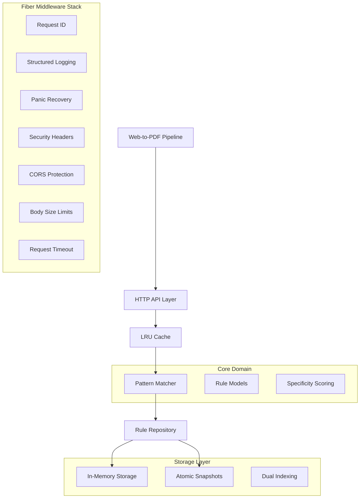
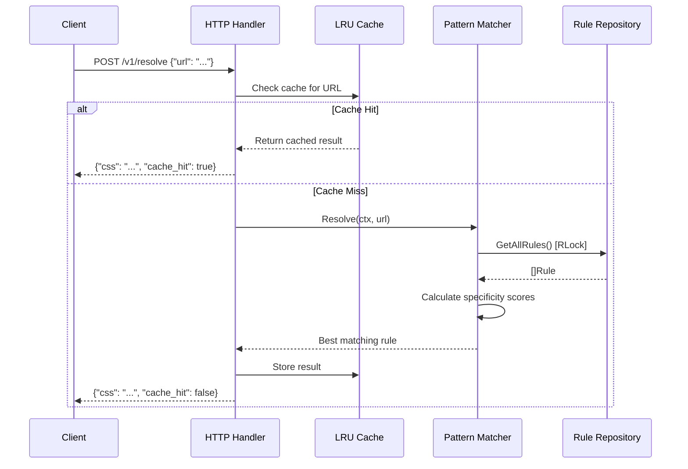

# Design Document: Asset Injector Microservice

## Overview

The Asset Injector Microservice is a high-performance Go-based service that implements a sophisticated URL pattern matching engine for Web-to-PDF pipelines. The system follows hexagonal architecture principles with clean separation between domain logic, storage, and transport layers. Built on Fiber v2 for maximum throughput, the service provides sub-millisecond response times through optimized concurrent processing, intelligent caching, and lock-free hot paths.

The core innovation lies in the specificity-based matching algorithm that calculates scores for URL patterns, ensuring the most relevant CSS/JavaScript assets are returned for each request. The system maintains data consistency through atomic snapshot persistence while supporting thousands of concurrent requests through read-write lock optimization.

## Architecture

### High-Level Architecture



### Component Interaction Flow



## Components and Interfaces

### Core Domain Interfaces

```go
// RuleRepository defines the contract for rule storage operations
type RuleRepository interface {
    GetAllRules(ctx context.Context) ([]Rule, error)
    GetRuleByID(ctx context.Context, id string) (*Rule, error)
    CreateRule(ctx context.Context, rule *Rule) error
    UpdateRule(ctx context.Context, rule *Rule) error
    DeleteRule(ctx context.Context, id string) error
    SaveSnapshot(ctx context.Context) error
}

// PatternMatcher defines the contract for URL matching operations
type PatternMatcher interface {
    Resolve(ctx context.Context, url string) (*MatchResult, error)
    AddRule(ctx context.Context, rule *Rule) error
    RemoveRule(ctx context.Context, id string) error
    InvalidateCache(ctx context.Context) error
}

// CacheManager defines the contract for caching operations
type CacheManager interface {
    Get(key string) (*MatchResult, bool)
    Set(key string, result *MatchResult)
    Invalidate(key string)
    Clear()
    Stats() CacheStats
}
```

### HTTP API Layer

The API layer implements RESTful endpoints using Fiber v2 with comprehensive middleware stack:

**Middleware Pipeline (Order Critical):**
1. **RequestID**: Generates UUID for request tracing
2. **Logger**: Structured JSON logging with zerolog
3. **Recovery**: Panic recovery with stack trace logging
4. **Security**: HSTS, XSS protection headers
5. **CORS**: Origin-based access control
6. **BodyLimit**: 1MB maximum payload protection
7. **Timeout**: 2-second hard timeout enforcement

**Endpoint Specifications:**
- `POST /v1/resolve`: URL pattern matching with caching
- `GET /v1/rules`: Rule listing with pagination support
- `POST /v1/rules`: Rule creation/update with validation
- `DELETE /v1/rules/:id`: Rule deletion with cascade cleanup
- `GET /health`: Kubernetes liveness probe
- `GET /metrics`: Prometheus-compatible metrics

### Pattern Matching Engine

The matcher implements a sophisticated scoring algorithm for URL pattern resolution:

**Scoring Algorithm:**
```
Final Score = Base Priority + Pattern Length + Manual Override
```

**Priority Tiers:**
- **Exact Match**: Base priority 1000 (highest specificity)
- **Regex Match**: Base priority 500 (medium specificity)  
- **Wildcard Match**: Base priority 100 (lowest specificity)

**Performance Optimizations:**
- Pre-compiled regex patterns stored in matcher struct
- Read-write locks for concurrent access (RLock for reads)
- Zero-allocation hot path for resolve operations
- Context-aware processing with timeout support

### Storage Architecture

**Dual Indexing Strategy:**
- **HashMap**: O(1) ID-based lookups for CRUD operations
- **Slice**: O(N) iteration for pattern matching resolution
- **Synchronization**: Both structures updated atomically

**Atomic Persistence:**
```
Write Process: Create Temp File → Write Data → Sync → Rename
```

This ensures crash-safe persistence with no partial writes or corruption.

## Data Models

### Rule Entity

```go
type Rule struct {
    ID        string     `json:"id" validate:"required,uuid4"`
    Type      string     `json:"type" validate:"required,oneof=exact regex wildcard"`
    Pattern   string     `json:"pattern" validate:"required,min=1,max=2048"`
    CSS       string     `json:"css" validate:"max=102400"` // 100KB limit
    JS        string     `json:"js" validate:"max=102400"`  // 100KB limit
    Priority  *int       `json:"priority,omitempty" validate:"omitempty,min=0,max=10000"`
    CreatedAt time.Time  `json:"created_at"`
    UpdatedAt time.Time  `json:"updated_at"`
    
    // Internal fields for performance
    compiledRegex *regexp.Regexp `json:"-"` // Pre-compiled for regex rules
}
```

### Match Result

```go
type MatchResult struct {
    RuleID    string `json:"rule_id"`
    CSS       string `json:"css"`
    JS        string `json:"js"`
    Score     int    `json:"score,omitempty"`
    CacheHit  bool   `json:"cache_hit"`
    Timestamp time.Time `json:"timestamp"`
}
```

### Configuration Model

```go
type Config struct {
    Server struct {
        Port         int           `env:"PORT" envDefault:"8080" validate:"min=1,max=65535"`
        ReadTimeout  time.Duration `env:"READ_TIMEOUT" envDefault:"5s"`
        WriteTimeout time.Duration `env:"WRITE_TIMEOUT" envDefault:"5s"`
        BodyLimit    int           `env:"BODY_LIMIT" envDefault:"1048576"` // 1MB
    }
    
    Cache struct {
        MaxSize    int           `env:"CACHE_MAX_SIZE" envDefault:"10000" validate:"min=100"`
        TTL        time.Duration `env:"CACHE_TTL" envDefault:"1h"`
    }
    
    Storage struct {
        DataDir      string `env:"DATA_DIR" envDefault:"./data"`
        SnapshotFile string `env:"SNAPSHOT_FILE" envDefault:"snapshot.json"`
    }
    
    Security struct {
        CORSOrigins []string `env:"CORS_ORIGINS" envSeparator:","`
        EnableHTTPS bool     `env:"ENABLE_HTTPS" envDefault:"false"`
    }
    
    Logging struct {
        Level  string `env:"LOG_LEVEL" envDefault:"info" validate:"oneof=debug info warn error"`
        Format string `env:"LOG_FORMAT" envDefault:"json" validate:"oneof=json text"`
    }
}
```

## Correctness Properties

*A property is a characteristic or behavior that should hold true across all valid executions of a system—essentially, a formal statement about what the system should do. Properties serve as the bridge between human-readable specifications and machine-verifiable correctness guarantees.*

### Pattern Matching Properties

**Property 1: Highest scoring rule selection**
*For any* URL and set of matching rules, the resolve operation should return the rule with the highest calculated specificity score among all matches.
**Validates: Requirements 1.1**

**Property 2: Specificity score calculation**
*For any* rule without manual priority override, the calculated score should equal BasePriority + PatternLength where BasePriority is determined by rule type.
**Validates: Requirements 1.2**

**Property 3: Manual priority override precedence**
*For any* rule with a manual priority value set, the final score should equal that priority value regardless of the calculated BasePriority + PatternLength formula.
**Validates: Requirements 1.3**

**Property 4: Base priority assignment by rule type**
*For any* rule, the base priority should be 1000 for exact matches, 500 for regex matches, and 100 for wildcard matches.
**Validates: Requirements 1.5, 1.6, 1.7**

**Property 5: Tie-breaking by pattern length**
*For any* two rules with identical calculated scores, the rule with the longer pattern length should be selected.
**Validates: Requirements 1.8**

### Concurrency and Performance Properties

**Property 6: Concurrent read access**
*For any* set of simultaneous resolve requests, they should all complete successfully without blocking each other when no write operations are occurring.
**Validates: Requirements 2.1**

**Property 7: Write operation exclusivity**
*For any* rule mutation operation, it should block all other read and write operations until completion to maintain data consistency.
**Validates: Requirements 2.2**

**Property 8: Regex pre-compilation**
*For any* rule with regex pattern type, the regex should be compiled during rule creation and invalid patterns should be rejected immediately.
**Validates: Requirements 2.3**

**Property 9: Cache hit consistency**
*For any* URL that has been resolved before, subsequent resolve requests should return identical results with cache_hit: true until cache invalidation occurs.
**Validates: Requirements 2.6, 9.3**

### Rule Management Properties

**Property 10: Automatic ID generation**
*For any* rule created without an ID field, the system should assign a valid UUID4 string as the ID.
**Validates: Requirements 3.1**

**Property 11: Regex validation on creation**
*For any* rule with type "regex", the pattern field should be validated for regex compilation and invalid patterns should be rejected with appropriate error.
**Validates: Requirements 3.2**

**Property 12: Content size limits**
*For any* rule with CSS or JS content exceeding 100KB, the creation should be rejected with validation error.
**Validates: Requirements 3.3**

**Property 13: Complete rule retrieval**
*For any* state of the rule repository, the GetAllRules operation should return every rule that has been created and not deleted.
**Validates: Requirements 3.4**

**Property 14: Rule deletion completeness**
*For any* rule that exists in the system, deleting it by ID should remove it from both memory storage and make it absent from subsequent queries.
**Validates: Requirements 3.5**

**Property 15: Timestamp preservation on update**
*For any* existing rule being updated, the CreatedAt timestamp should remain unchanged while UpdatedAt should reflect the modification time.
**Validates: Requirements 3.6**

**Property 16: Atomic snapshot persistence**
*For any* rule operation (create, update, delete), the changes should be persisted to disk using atomic write operations.
**Validates: Requirements 3.7, 4.3**

### Storage and Persistence Properties

**Property 17: Startup rule loading**
*For any* valid snapshot.json file present at startup, all rules contained within should be loaded into memory storage correctly.
**Validates: Requirements 4.1**

**Property 18: Dual index synchronization**
*For any* rule operation, both the map and slice data structures should contain identical rule data after the operation completes.
**Validates: Requirements 4.4**

**Property 19: Thread-safe concurrent access**
*For any* combination of concurrent read and write operations, no race conditions should occur and data integrity should be maintained.
**Validates: Requirements 4.7**

### HTTP API Properties

**Property 20: Resolve endpoint functionality**
*For any* valid JSON request to POST /v1/resolve with a url field, the response should contain the matching CSS/JS assets or empty values if no match exists.
**Validates: Requirements 5.1**

**Property 21: Rules listing endpoint**
*For any* GET request to /v1/rules, the response should contain all active rules in valid JSON format.
**Validates: Requirements 5.2**

**Property 22: Rule creation endpoint**
*For any* valid rule data sent to POST /v1/rules, the rule should be created with proper validation and return 201 status code.
**Validates: Requirements 5.3, 5.10**

**Property 23: Rule deletion endpoint**
*For any* existing rule ID sent to DELETE /v1/rules/:id, the rule should be removed and subsequent queries should not return it.
**Validates: Requirements 5.4**

**Property 24: Body size limit enforcement**
*For any* request with body size exceeding 1MB, the server should reject it with 413 Payload Too Large status.
**Validates: Requirements 5.7, 6.3**

**Property 25: Input sanitization**
*For any* input containing leading or trailing whitespace, the system should automatically trim it before processing.
**Validates: Requirements 5.8**

**Property 26: Validation error responses**
*For any* request with invalid data, the system should return 422 status with structured error message containing details about the validation failure.
**Validates: Requirements 5.9**

### Security Properties

**Property 27: CORS enforcement**
*For any* request from an origin not in the allowed list, the server should enforce CORS restrictions appropriately.
**Validates: Requirements 6.1**

**Property 28: Security headers inclusion**
*For any* HTTP response, the required security headers (HSTS, XSS protection) should be included.
**Validates: Requirements 6.2**

**Property 29: Request timeout enforcement**
*For any* request taking longer than 2 seconds, the server should terminate it with appropriate timeout response.
**Validates: Requirements 6.4**

**Property 30: Panic recovery**
*For any* panic occurring in request handlers, the server should recover gracefully and return 500 status without crashing.
**Validates: Requirements 6.5**

**Property 31: Unique request ID generation**
*For any* incoming request, a unique UUID should be generated and used for request tracing throughout the processing pipeline.
**Validates: Requirements 6.6**

### Observability Properties

**Property 32: Structured request logging**
*For any* processed request, the log entry should contain request ID, method, path, latency, and status code in structured JSON format.
**Validates: Requirements 7.1**

**Property 33: Cache metrics tracking**
*For any* cache operation (hit or miss), the corresponding atomic counters should be incremented accurately.
**Validates: Requirements 7.2**

**Property 34: Metrics endpoint data**
*For any* request to GET /metrics, the response should include current cache statistics, rule count, and uptime information.
**Validates: Requirements 5.6, 7.3**

**Property 35: Error logging with details**
*For any* error or panic, detailed information including stack traces should be logged appropriately.
**Validates: Requirements 7.4**

### Configuration Properties

**Property 36: Configuration validation**
*For any* invalid configuration value (invalid ports, negative cache sizes, malformed CORS origins), the system should fail fast with clear error messages.
**Validates: Requirements 8.2, 8.3, 8.4, 8.5**

**Property 37: Environment configuration loading**
*For any* valid environment variables or .env file values, they should be loaded and applied correctly during startup.
**Validates: Requirements 8.1**

### Caching Properties

**Property 38: LRU cache size limits**
*For any* cache configuration, when the number of entries exceeds the maximum size, the least recently used entries should be evicted first.
**Validates: Requirements 9.1, 9.2**

**Property 39: Cache miss handling**
*For any* URL not present in cache, the full matching logic should execute and the result should be stored for future requests.
**Validates: Requirements 9.4**

**Property 40: Cache invalidation on rule changes**
*For any* rule modification operation, affected cache entries should be invalidated to maintain consistency between cached and computed results.
**Validates: Requirements 9.5**

## Error Handling

### Error Classification

The system implements a comprehensive error handling strategy with domain-specific error types:

```go
type AppError struct {
    Code       string `json:"code"`
    Message    string `json:"message"`
    StatusCode int    `json:"-"`
    Details    any    `json:"details,omitempty"`
}

// Error categories
const (
    ErrInvalidInput     = "INVALID_INPUT"      // 400 Bad Request
    ErrValidationFailed = "VALIDATION_FAILED"  // 422 Unprocessable Entity
    ErrNotFound        = "NOT_FOUND"          // 404 Not Found
    ErrConflict        = "CONFLICT"           // 409 Conflict
    ErrInternal        = "INTERNAL_ERROR"     // 500 Internal Server Error
    ErrTimeout         = "TIMEOUT"            // 408 Request Timeout
    ErrTooLarge        = "PAYLOAD_TOO_LARGE"  // 413 Payload Too Large
)
```

### Error Response Format

All API errors return consistent JSON structure:

```json
{
    "status": "error",
    "code": "VALIDATION_FAILED",
    "message": "Rule pattern is invalid",
    "details": {
        "field": "pattern",
        "value": "[invalid-regex",
        "reason": "unclosed bracket in regex"
    }
}
```

### Panic Recovery Strategy

The recovery middleware captures panics and:
1. Logs full stack trace with request context
2. Returns generic 500 error to client (no internal details exposed)
3. Increments panic counter in metrics
4. Continues serving other requests

## Testing Strategy

### Dual Testing Approach

The system employs both unit testing and property-based testing for comprehensive coverage:

**Unit Tests:**
- Specific examples demonstrating correct behavior
- Edge cases and boundary conditions
- Integration points between components
- Error conditions and failure scenarios

**Property-Based Tests:**
- Universal properties verified across randomized inputs
- Minimum 100 iterations per property test
- Each test tagged with: **Feature: asset-injector-microservice, Property {number}: {property_text}**
- Comprehensive input space coverage through intelligent generators

### Testing Framework Selection

**Property-Based Testing Library:** [gopter](https://github.com/leanovate/gopter)
- Native Go implementation with excellent performance
- Rich set of generators for complex data types
- Shrinking support for minimal failing examples
- Integration with standard Go testing framework

**Unit Testing:** Standard Go testing package with testify for assertions

### Test Configuration

```go
// Property test configuration
const (
    PropertyTestIterations = 100
    PropertyTestMaxSize   = 1000
    PropertyTestWorkers   = 4
)

// Each property test must include this tag format:
// Feature: asset-injector-microservice, Property 1: Highest scoring rule selection
```

### Test Data Generation Strategy

**Smart Generators:**
- **URL Generator**: Produces valid URLs with various schemes, domains, paths, and query parameters
- **Rule Generator**: Creates rules with different types, patterns, and content sizes
- **Pattern Generator**: Generates exact, regex, and wildcard patterns with controlled complexity
- **Content Generator**: Produces CSS/JS content within and exceeding size limits

**Edge Case Coverage:**
- Empty inputs and boundary values
- Unicode and special characters in URLs and patterns
- Malformed JSON and invalid data types
- Concurrent access patterns and race conditions
```

Now I need to use the prework tool to analyze the acceptance criteria before writing the correctness properties:

<function_calls>
<invoke name="prework">
<parameter name="featureName">asset-injector-microservice