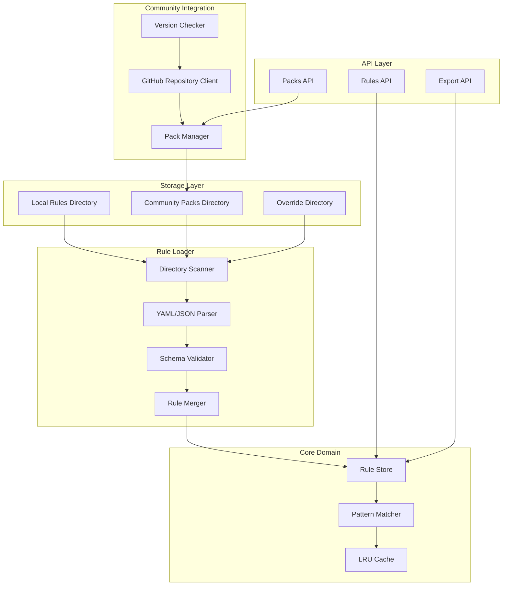
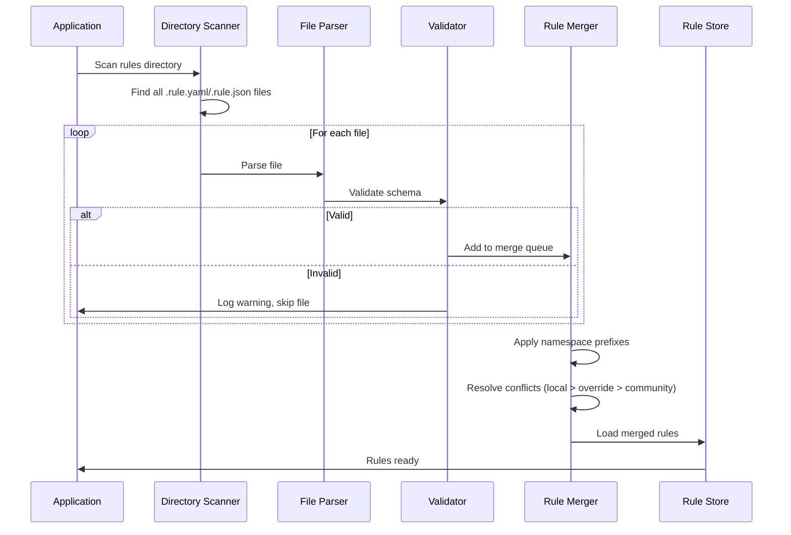

# Design Document: Community Sharing

## Overview

The Community Sharing feature transforms the Asset Injector from a single-user tool into a collaborative platform. It replaces the monolithic `snapshot.json` with a modular, file-based rule storage system that integrates with GitHub for community sharing. The design prioritizes Git-friendliness, clear attribution, and seamless conflict resolution while maintaining backward compatibility with existing matching logic.

The architecture introduces three key concepts: **Rule Files** (individual YAML/JSON files), **Rule Packs** (bundled collections with manifests), and **Sources** (local, community, override) with clear priority ordering.

## Architecture

### High-Level Architecture



### Directory Structure

```
rules/
├── local/                          # User's custom rules (highest priority)
│   ├── my-custom-rules.rule.yaml
│   └── site-specific/
│       └── example-com.rule.yaml
├── community/                      # Installed community packs
│   ├── cookie-banners/
│   │   ├── manifest.yaml
│   │   ├── rules/
│   │   │   ├── gdpr-banners.rule.yaml
│   │   │   └── ccpa-notices.rule.yaml
│   │   └── .source.json            # Tracks origin URL and version
│   └── ad-blockers/
│       ├── manifest.yaml
│       └── rules/
│           └── common-ads.rule.yaml
├── overrides/                      # Local modifications to community rules
│   └── cookie-banners/
│       └── custom-fix.rule.yaml
└── .disabled.json                  # List of disabled rule IDs
```

### Rule Loading Flow



## Components and Interfaces

### Core Interfaces

```go
// RuleLoader handles loading rules from the file system
type RuleLoader interface {
    // LoadAll scans directories and returns all valid rules
    LoadAll(ctx context.Context) ([]Rule, []LoadError, error)
    // Reload triggers a full reload of all rules
    Reload(ctx context.Context) error
    // Watch starts watching for file changes (optional)
    Watch(ctx context.Context) (<-chan RuleChangeEvent, error)
}

// PackManager handles rule pack operations
type PackManager interface {
    // ListInstalled returns all installed packs
    ListInstalled(ctx context.Context) ([]PackInfo, error)
    // ListAvailable fetches available packs from community repo
    ListAvailable(ctx context.Context) ([]PackInfo, error)
    // Install downloads and installs a pack
    Install(ctx context.Context, source string) error
    // Uninstall removes an installed pack
    Uninstall(ctx context.Context, name string) error
    // Update updates a pack to the latest version
    Update(ctx context.Context, name string) error
    // CheckUpdates returns packs with available updates
    CheckUpdates(ctx context.Context) ([]PackUpdate, error)
}

// RuleExporter handles rule export operations
type RuleExporter interface {
    // ExportRule exports a single rule to YAML
    ExportRule(ctx context.Context, id string) ([]byte, error)
    // ExportPack exports rules as a complete pack
    ExportPack(ctx context.Context, opts ExportOptions) (io.Reader, error)
}

// CommunityClient handles GitHub repository interactions
type CommunityClient interface {
    // FetchIndex retrieves the pack index from the repository
    FetchIndex(ctx context.Context) (*PackIndex, error)
    // DownloadPack downloads a pack archive
    DownloadPack(ctx context.Context, name, version string) (io.Reader, error)
    // GetLatestVersion returns the latest version of a pack
    GetLatestVersion(ctx context.Context, name string) (string, error)
}
```

### Extended Rule Model

```go
// Rule with extended metadata for community sharing
type Rule struct {
    // Core fields (existing)
    ID        string     `yaml:"id" json:"id"`
    Type      string     `yaml:"type" json:"type"`
    Pattern   string     `yaml:"pattern" json:"pattern"`
    CSS       string     `yaml:"css" json:"css"`
    JS        string     `yaml:"js" json:"js"`
    Priority  *int       `yaml:"priority,omitempty" json:"priority,omitempty"`
    
    // Attribution fields (new)
    Author      string    `yaml:"author,omitempty" json:"author,omitempty"`
    ModifiedBy  string    `yaml:"modified_by,omitempty" json:"modified_by,omitempty"`
    Description string    `yaml:"description,omitempty" json:"description,omitempty"`
    Tags        []string  `yaml:"tags,omitempty" json:"tags,omitempty"`
    
    // Source tracking (internal)
    Source      RuleSource `yaml:"-" json:"source,omitempty"`
    FilePath    string     `yaml:"-" json:"file_path,omitempty"`
    
    // Timestamps
    CreatedAt   time.Time `yaml:"created_at,omitempty" json:"created_at"`
    UpdatedAt   time.Time `yaml:"updated_at,omitempty" json:"updated_at"`
    
    // Internal
    compiledRegex *regexp.Regexp `yaml:"-" json:"-"`
}

// RuleSource tracks where a rule came from
type RuleSource struct {
    Type      SourceType `json:"type"`       // local, community, override
    PackName  string     `json:"pack_name,omitempty"`
    PackVersion string   `json:"pack_version,omitempty"`
    SourceURL string     `json:"source_url,omitempty"`
}

type SourceType string

const (
    SourceLocal     SourceType = "local"
    SourceCommunity SourceType = "community"
    SourceOverride  SourceType = "override"
)
```


### Pack Manifest Schema

```yaml
# manifest.yaml
name: cookie-banners           # Required: unique pack identifier
version: 1.2.0                 # Required: semantic version
description: |                 # Required: pack description
  Rules for hiding cookie consent banners and GDPR notices
author: community-user         # Required: pack author
license: MIT                   # Optional: license identifier
homepage: https://github.com/user/repo  # Optional: project URL

# Optional: dependencies on other packs
dependencies:
  - name: base-rules
    version: ">=1.0.0"

# Optional: tags for discovery
tags:
  - privacy
  - cookies
  - gdpr

# Optional: minimum Asset Injector version
requires:
  asset-injector: ">=2.0.0"
```

### Rule File Schema

```yaml
# example.rule.yaml
rules:
  - id: gdpr-cookie-banner-1
    type: wildcard
    pattern: "*.example.com/*"
    css: |
      .cookie-banner { display: none !important; }
    js: |
      document.querySelector('.cookie-banner')?.remove();
    author: contributor-name
    description: Hides cookie banner on example.com
    tags:
      - cookies
      - example.com

  - id: gdpr-cookie-banner-2
    type: regex
    pattern: "https?://.*\\.example\\.(com|org)/.*"
    css: |
      #consent-modal { display: none !important; }
    author: contributor-name
```

## Data Models

### Pack Information

```go
// PackInfo represents metadata about an installed or available pack
type PackInfo struct {
    Name        string    `json:"name"`
    Version     string    `json:"version"`
    Description string    `json:"description"`
    Author      string    `json:"author"`
    License     string    `json:"license,omitempty"`
    Homepage    string    `json:"homepage,omitempty"`
    Tags        []string  `json:"tags,omitempty"`
    RuleCount   int       `json:"rule_count"`
    InstalledAt time.Time `json:"installed_at,omitempty"`
    SourceURL   string    `json:"source_url,omitempty"`
}

// PackUpdate represents an available update for an installed pack
type PackUpdate struct {
    Name           string `json:"name"`
    CurrentVersion string `json:"current_version"`
    LatestVersion  string `json:"latest_version"`
    ChangelogURL   string `json:"changelog_url,omitempty"`
}

// PackIndex represents the community repository index
type PackIndex struct {
    Version     string     `json:"version"`
    UpdatedAt   time.Time  `json:"updated_at"`
    Packs       []PackInfo `json:"packs"`
    Categories  []string   `json:"categories,omitempty"`
}
```

### Load and Export Types

```go
// LoadError represents an error loading a specific file
type LoadError struct {
    FilePath string `json:"file_path"`
    Error    string `json:"error"`
    Line     int    `json:"line,omitempty"`
}

// RuleChangeEvent represents a file system change
type RuleChangeEvent struct {
    Type     ChangeType `json:"type"` // created, modified, deleted
    FilePath string     `json:"file_path"`
    RuleIDs  []string   `json:"rule_ids,omitempty"`
}

// ExportOptions configures pack export
type ExportOptions struct {
    Name        string   `json:"name"`
    Version     string   `json:"version"`
    Description string   `json:"description"`
    Author      string   `json:"author"`
    RuleIDs     []string `json:"rule_ids,omitempty"` // Empty = all local rules
    Format      string   `json:"format"`             // "yaml" or "json"
}

// ConflictInfo describes a rule ID conflict
type ConflictInfo struct {
    RuleID      string       `json:"rule_id"`
    Sources     []RuleSource `json:"sources"`
    ActiveSource RuleSource  `json:"active_source"`
}
```

### Configuration Extension

```go
// CommunityConfig extends the main config for community features
type CommunityConfig struct {
    // Directory paths
    RulesDir     string `env:"RULES_DIR" envDefault:"./rules"`
    LocalDir     string `env:"LOCAL_RULES_DIR" envDefault:"./rules/local"`
    CommunityDir string `env:"COMMUNITY_RULES_DIR" envDefault:"./rules/community"`
    OverrideDir  string `env:"OVERRIDE_RULES_DIR" envDefault:"./rules/overrides"`
    
    // Community repository
    RepoURL      string        `env:"COMMUNITY_REPO_URL" envDefault:"https://api.github.com/repos/asset-injector/community-rules"`
    RepoTimeout  time.Duration `env:"COMMUNITY_REPO_TIMEOUT" envDefault:"30s"`
    
    // Behavior
    AutoUpdate   bool          `env:"AUTO_UPDATE_PACKS" envDefault:"false"`
    WatchFiles   bool          `env:"WATCH_RULE_FILES" envDefault:"false"`
}
```

## Correctness Properties

*A property is a characteristic or behavior that should hold true across all valid executions of a system—essentially, a formal statement about what the system should do. Properties serve as the bridge between human-readable specifications and machine-verifiable correctness guarantees.*

### File Loading Properties

**Property 1: Rule file round-trip consistency**
*For any* valid rule created via API, saving it to disk and reloading should produce an equivalent rule with all fields preserved.
**Validates: Requirements 1.6, 1.7**

**Property 2: File extension filtering**
*For any* directory containing files with various extensions, only files ending in `.rule.yaml` or `.rule.json` should be loaded as rules.
**Validates: Requirements 1.2**

**Property 3: Multi-rule file loading**
*For any* rule file containing N valid rules, loading that file should result in exactly N rules being added to the store.
**Validates: Requirements 1.3**

**Property 4: Recursive directory scanning**
*For any* directory structure with rule files at various depths, all rule files should be discovered and loaded regardless of nesting level.
**Validates: Requirements 1.4**

**Property 5: Invalid file resilience**
*For any* set of rule files where some contain invalid syntax, the valid files should still be loaded successfully and invalid files should be skipped with warnings.
**Validates: Requirements 1.5**

### Pack Management Properties

**Property 6: Manifest validation**
*For any* rule pack, it should be rejected if the manifest is missing required fields (name, version, description, author).
**Validates: Requirements 2.1, 2.2**

**Property 7: Namespace prefixing**
*For any* rule loaded from a community pack, its effective ID should be prefixed with the pack namespace to prevent collisions with local rules.
**Validates: Requirements 2.3**

**Property 8: Semantic version comparison**
*For any* two pack versions, the version comparison should follow semantic versioning rules (major.minor.patch).
**Validates: Requirements 2.6**

**Property 9: Source tracking persistence**
*For any* installed community pack, the source URL and version should be recorded and retrievable after service restart.
**Validates: Requirements 3.3**

**Property 10: Override preservation during updates**
*For any* community pack with local overrides, updating the pack should preserve all override files unchanged.
**Validates: Requirements 3.5**

### Import/Export Properties

**Property 11: Export format validity**
*For any* exported rule or pack, the output should be valid YAML/JSON that can be re-imported without errors.
**Validates: Requirements 4.3, 4.4**

**Property 12: Duplicate ID detection**
*For any* import operation where a rule ID already exists, the system should detect and report the conflict.
**Validates: Requirements 4.2**

**Property 13: Content security validation**
*For any* imported rule, CSS and JS content should be validated against size limits (100KB) and rejected if exceeded.
**Validates: Requirements 4.5**

**Property 14: Bulk import partial success**
*For any* bulk import with some invalid rules, valid rules should be imported successfully and invalid ones should be reported.
**Validates: Requirements 4.6**

### Attribution Properties

**Property 15: Attribution metadata preservation**
*For any* rule with author information, the author field should be preserved through save, load, and export operations.
**Validates: Requirements 5.1, 5.3, 5.4, 5.5**

**Property 16: Modification tracking**
*For any* rule that is modified, the UpdatedAt timestamp should be updated and optionally the ModifiedBy field.
**Validates: Requirements 5.2**

**Property 17: Override attribution**
*For any* community rule that is modified locally, a new override file should be created with the modifier's attribution.
**Validates: Requirements 5.6**

### Conflict Resolution Properties

**Property 18: Source priority ordering**
*For any* rule ID that exists in multiple sources, the effective rule should come from the highest priority source (local > override > community).
**Validates: Requirements 6.1**

**Property 19: Conflict detection and reporting**
*For any* rule ID that exists in multiple sources, the conflict should be detected and reported in rule listings.
**Validates: Requirements 6.2, 6.6**

**Property 20: Disabled rule persistence**
*For any* rule that is disabled by the user, the disabled state should persist across service restarts.
**Validates: Requirements 6.5**

**Property 21: Cross-pack URL matching**
*For any* URL that matches rules from different packs, the standard specificity scoring should determine the winner.
**Validates: Requirements 6.4**

### API Properties

**Property 22: Pack listing completeness**
*For any* set of installed packs, GET /v1/packs should return all of them with correct metadata.
**Validates: Requirements 7.1**

**Property 23: Pack uninstall completeness**
*For any* installed pack, DELETE /v1/packs/:name should remove all its rules and the pack directory.
**Validates: Requirements 7.3**

**Property 24: Rule source endpoint**
*For any* rule ID, GET /v1/rules/:id/source should return the correct origin and attribution information.
**Validates: Requirements 7.6**

**Property 25: Export endpoint functionality**
*For any* export request, POST /v1/rules/export should generate a valid downloadable pack file.
**Validates: Requirements 7.7**

## Error Handling

### Error Types

```go
// Community-specific error codes
const (
    ErrPackNotFound      = "PACK_NOT_FOUND"
    ErrPackInvalid       = "PACK_INVALID"
    ErrManifestInvalid   = "MANIFEST_INVALID"
    ErrVersionConflict   = "VERSION_CONFLICT"
    ErrDependencyMissing = "DEPENDENCY_MISSING"
    ErrImportFailed      = "IMPORT_FAILED"
    ErrExportFailed      = "EXPORT_FAILED"
    ErrRepoUnavailable   = "REPO_UNAVAILABLE"
    ErrRuleConflict      = "RULE_CONFLICT"
)
```

### Error Responses

```json
{
    "status": "error",
    "code": "MANIFEST_INVALID",
    "message": "Pack manifest is missing required fields",
    "details": {
        "pack": "my-pack",
        "missing_fields": ["version", "author"]
    }
}
```

### Graceful Degradation

- If community repository is unavailable, continue with cached packs
- If a rule file is invalid, skip it and continue loading others
- If a pack dependency is missing, warn but still load the pack
- If file watching fails, fall back to manual reload

## Testing Strategy

### Property-Based Testing Library

**Library:** [gopter](https://github.com/leanovate/gopter) - Native Go property-based testing

### Test Configuration

```go
const (
    PropertyTestIterations = 100
    PropertyTestMaxSize    = 1000
)
```

### Smart Generators

```go
// RuleFileGenerator generates valid rule files with random content
func RuleFileGenerator() gopter.Gen {
    return gen.Struct(reflect.TypeOf(RuleFile{}), map[string]gopter.Gen{
        "Rules": gen.SliceOfN(1, 10, RuleGenerator()),
    })
}

// ManifestGenerator generates pack manifests with various validity states
func ManifestGenerator(valid bool) gopter.Gen {
    // Generates manifests with/without required fields
}

// DirectoryStructureGenerator generates nested directory trees with rule files
func DirectoryStructureGenerator(maxDepth int) gopter.Gen {
    // Generates directory structures for recursive scanning tests
}
```

### Test Categories

**Unit Tests:**
- YAML/JSON parsing edge cases
- Manifest schema validation
- Semantic version comparison
- Namespace prefixing logic
- Conflict detection algorithms

**Property Tests:**
- Round-trip consistency (save → load → compare)
- File extension filtering across random file sets
- Priority ordering with random conflict scenarios
- Export validity across random rule sets

**Integration Tests:**
- Full directory scanning with real file system
- Pack installation from mock repository
- API endpoint behavior with various inputs
