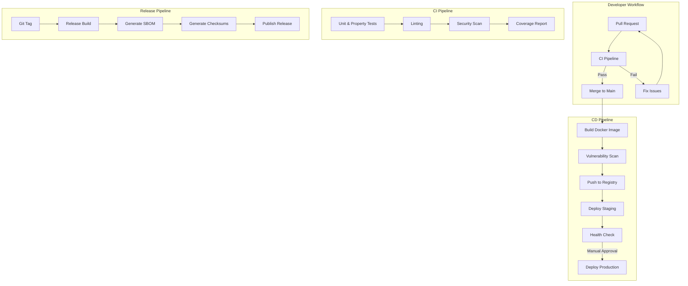
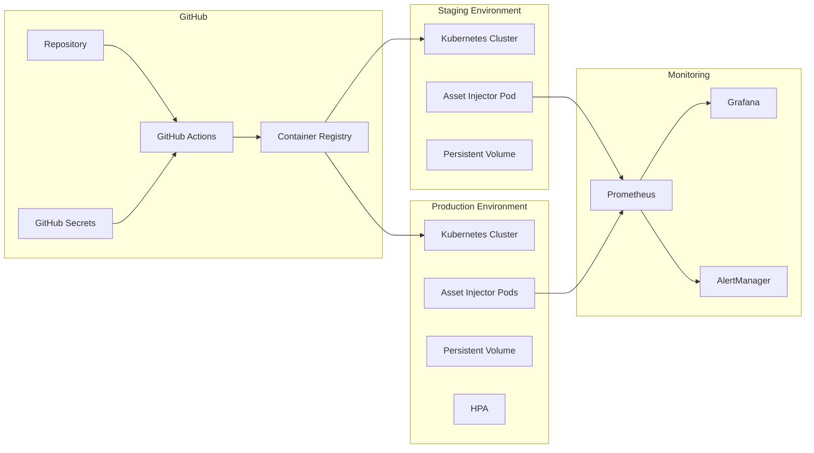

# Design Document: Deployment and Operations

## Overview

This design document outlines the CI/CD pipeline architecture, deployment strategies, and operational infrastructure for the Asset Injector Microservice. The design leverages GitHub Actions for automation, Docker for containerization, and Kubernetes for orchestration, with comprehensive monitoring and security scanning integrated throughout the pipeline.

## Architecture

### High-Level Pipeline Architecture



### Deployment Architecture



## Components and Interfaces

### GitHub Actions Workflows

#### 1. CI Workflow (`ci.yml`)

Triggered on pull requests and pushes to main branch.

```yaml
# Workflow structure
name: CI
on:
  pull_request:
    branches: [main]
  push:
    branches: [main]

jobs:
  test:
    # Run unit tests with race detection
    # Run property-based tests
    # Generate coverage report
    
  lint:
    # Run golangci-lint
    
  security:
    # Run govulncheck for Go dependencies
    # Run gitleaks for secret detection
```

#### 2. CD Workflow (`cd.yml`)

Triggered on successful main branch builds and releases.

```yaml
# Workflow structure
name: CD
on:
  push:
    branches: [main]
  release:
    types: [published]

jobs:
  build:
    # Build Docker image
    # Tag with commit SHA or release version
    
  scan:
    # Run Trivy vulnerability scan
    # Fail on critical/high vulnerabilities
    
  push:
    # Push to GitHub Container Registry
    
  deploy-staging:
    # Deploy to staging environment
    # Run health checks
    
  deploy-production:
    # Require manual approval
    # Deploy with rolling update
    # Verify health
```

#### 3. Release Workflow (`release.yml`)

Triggered on version tags.

```yaml
# Workflow structure
name: Release
on:
  push:
    tags: ['v*']

jobs:
  release:
    # Build release artifacts
    # Generate SBOM with syft
    # Generate checksums
    # Create GitHub release with notes
```

### Deployment Scripts

#### Health Check Script (`scripts/health-check.sh`)

```bash
#!/bin/bash
# Verifies deployment health by checking /health endpoint
# Supports configurable timeout and retry logic
# Returns exit code 0 on success, 1 on failure
```

#### Rollback Script (`scripts/rollback.sh`)

```bash
#!/bin/bash
# Rolls back to previous deployment version
# Supports Kubernetes rollback commands
# Sends notifications on rollback
```

### Kubernetes Manifests

#### Directory Structure

```
deploy/
├── base/
│   ├── deployment.yaml
│   ├── service.yaml
│   ├── configmap.yaml
│   └── kustomization.yaml
├── overlays/
│   ├── staging/
│   │   ├── kustomization.yaml
│   │   └── patches/
│   └── production/
│       ├── kustomization.yaml
│       ├── hpa.yaml
│       └── patches/
├── monitoring/
│   ├── servicemonitor.yaml
│   └── alerting-rules.yaml
└── docker-compose.yml
```

### Container Configuration

#### Dockerfile Enhancements

The existing Dockerfile will be enhanced with:
- Security scanning labels
- Health check instruction
- Non-root user verification
- Minimal attack surface

```dockerfile
# Multi-stage build (existing)
FROM golang:1.21-alpine AS builder
# ... build steps ...

FROM scratch
# Security labels
LABEL org.opencontainers.image.source="https://github.com/owner/asset-injector"
LABEL org.opencontainers.image.description="Asset Injector Microservice"

# Copy binary and set user
COPY --from=builder /app/server /server
USER 65534:65534

# Health check
HEALTHCHECK --interval=30s --timeout=3s --start-period=5s --retries=3 \
  CMD ["/server", "-health-check"] || exit 1

EXPOSE 8080
ENTRYPOINT ["/server"]
```

## Data Models

### Deployment Configuration

```go
// DeploymentConfig represents environment-specific deployment settings
type DeploymentConfig struct {
    Environment     string            `yaml:"environment"`
    Replicas        int               `yaml:"replicas"`
    Resources       ResourceConfig    `yaml:"resources"`
    HealthCheck     HealthCheckConfig `yaml:"healthCheck"`
    Autoscaling     AutoscalingConfig `yaml:"autoscaling,omitempty"`
}

type ResourceConfig struct {
    Requests ResourceLimits `yaml:"requests"`
    Limits   ResourceLimits `yaml:"limits"`
}

type ResourceLimits struct {
    CPU    string `yaml:"cpu"`
    Memory string `yaml:"memory"`
}

type HealthCheckConfig struct {
    Path                string `yaml:"path"`
    Port                int    `yaml:"port"`
    InitialDelaySeconds int    `yaml:"initialDelaySeconds"`
    PeriodSeconds       int    `yaml:"periodSeconds"`
    TimeoutSeconds      int    `yaml:"timeoutSeconds"`
    FailureThreshold    int    `yaml:"failureThreshold"`
}

type AutoscalingConfig struct {
    Enabled     bool `yaml:"enabled"`
    MinReplicas int  `yaml:"minReplicas"`
    MaxReplicas int  `yaml:"maxReplicas"`
    TargetCPU   int  `yaml:"targetCPUUtilizationPercentage"`
}
```

### Release Metadata

```go
// ReleaseInfo represents release artifact metadata
type ReleaseInfo struct {
    Version     string    `json:"version"`
    CommitSHA   string    `json:"commitSha"`
    BuildTime   time.Time `json:"buildTime"`
    GoVersion   string    `json:"goVersion"`
    Checksums   Checksums `json:"checksums"`
}

type Checksums struct {
    SHA256 string `json:"sha256"`
    SHA512 string `json:"sha512"`
}
```

## Correctness Properties

*A property is a characteristic or behavior that should hold true across all valid executions of a system—essentially, a formal statement about what the system should do. Properties serve as the bridge between human-readable specifications and machine-verifiable correctness guarantees.*

### Property 1: Semantic Version Format Validation

*For any* release version string, it SHALL match the pattern `vX.Y.Z` where X, Y, and Z are non-negative integers, and parsing SHALL extract major, minor, and patch components correctly.

**Validates: Requirements 3.1**

### Property 2: Health Check Verification

*For any* deployed instance, the health check script SHALL return success (exit code 0) if and only if the /health endpoint returns HTTP 200 within the configured timeout.

**Validates: Requirements 2.7, 4.4, 4.5**

### Property 3: Rollback Idempotency

*For any* deployment state, executing rollback multiple times SHALL result in the same previous version being active, and SHALL NOT cause additional rollbacks beyond the immediate previous version.

**Validates: Requirements 6.2**

### Property 4: OpenTelemetry Trace Propagation

*For any* incoming request with trace context headers (traceparent, tracestate), the application SHALL propagate these headers to any outgoing requests and include the trace ID in structured logs.

**Validates: Requirements 8.6**

## Error Handling

### CI/CD Pipeline Errors

| Error Scenario | Handling Strategy |
|---------------|-------------------|
| Test failure | Block merge, report failure status |
| Lint failure | Block merge, provide fix suggestions |
| Security vulnerability (critical/high) | Block build, generate report |
| Docker build failure | Fail job, preserve build logs |
| Registry push failure | Retry with exponential backoff |
| Deployment failure | Automatic rollback, notify team |
| Health check failure | Rollback, alert operators |

### Deployment Errors

```yaml
# Kubernetes deployment strategy with rollback
spec:
  strategy:
    type: RollingUpdate
    rollingUpdate:
      maxSurge: 1
      maxUnavailable: 0
  minReadySeconds: 10
  progressDeadlineSeconds: 120
```

### Notification Strategy

- **Slack/Discord**: Deployment status, rollback alerts
- **Email**: Security scan reports, release notifications
- **GitHub Issues**: Automatic issue creation for critical failures

## Testing Strategy

### Workflow Testing

Since GitHub Actions workflows are YAML configuration, testing focuses on:

1. **Syntax Validation**: Use `actionlint` to validate workflow syntax
2. **Local Testing**: Use `act` to run workflows locally
3. **Integration Testing**: Test workflows in a fork before merging

### Script Testing

Deployment scripts will have unit tests:

```bash
# Test health check script
test_health_check_success() {
    # Mock successful health endpoint
    # Verify script returns 0
}

test_health_check_timeout() {
    # Mock slow/unresponsive endpoint
    # Verify script returns 1 after timeout
}

test_health_check_retry() {
    # Mock intermittent failures
    # Verify retry logic works correctly
}
```

### Infrastructure Testing

1. **Manifest Validation**: Use `kubeval` or `kubeconform` to validate Kubernetes manifests
2. **Helm Chart Testing**: Use `helm lint` and `helm template` for chart validation
3. **Policy Testing**: Use `conftest` with OPA policies for security compliance

### Property-Based Tests

Property tests will be implemented for:

1. **Version parsing**: Test semantic version validation across random valid/invalid inputs
2. **Health check logic**: Test health check script behavior with various response scenarios
3. **Rollback behavior**: Test rollback script idempotency

### Test Configuration

- **Unit tests**: Validate individual script functions
- **Integration tests**: Validate end-to-end workflow behavior
- **Property tests**: Validate universal properties with 100+ iterations
- **Smoke tests**: Post-deployment verification in each environment
